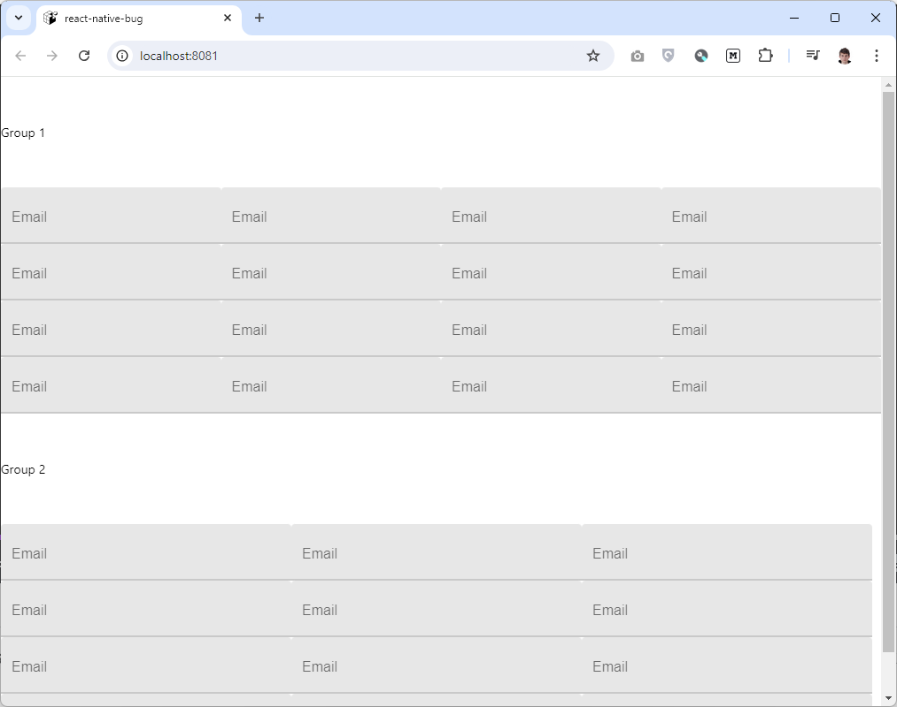
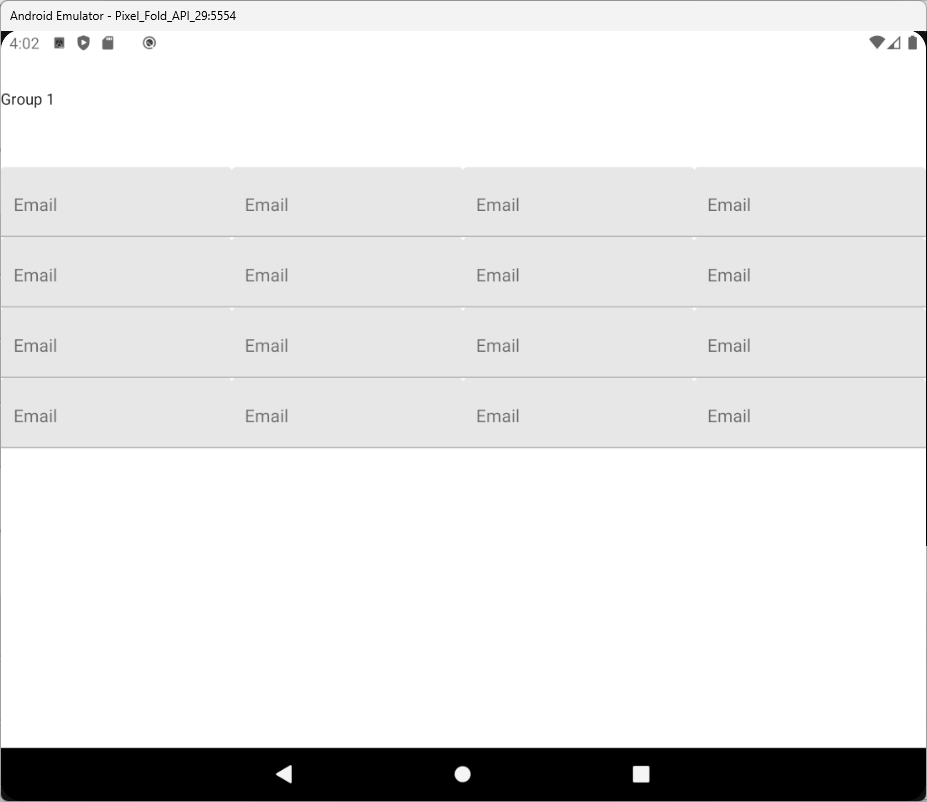

# react-native-bug

> The same code published to [Expo Snack by the link](https://snack.expo.dev/@tripolskypetr/react-native-bug)

## Reproduce

1. **Setup enviroment**

Install Android Studio, create Android Emulator, install npm dependencies

```bash
cd react-native-bug
npm install
```

2. **Open in web**

As you can see, there are `Group 1` and `Group 2` with several text inputs



```bash
npm run web
```

3. **Launch on android**

Ooops. `Group 2` is missing



```bash
npm run android
```
